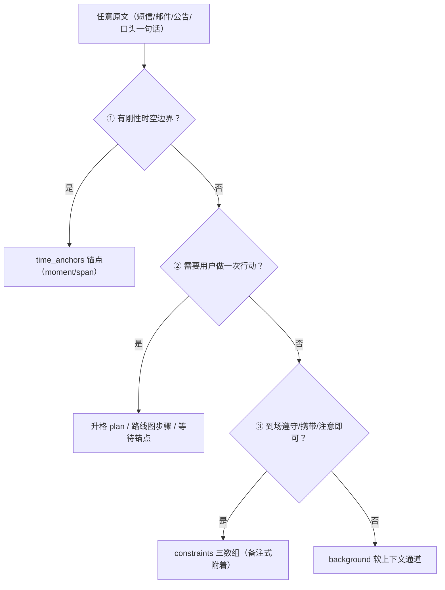
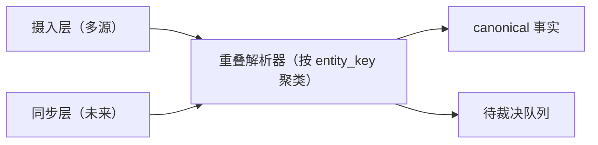

# 事实挂载 · 用户/好友体系 · 外部盲中继 — 设计草案

> **状态**：**定稿已拍板**（2026-10-07 用户拍板：§0 七项+四洞察全部通过；同轮裁决 D2=未归属池宿主挂载 sheet 常驻组；schema 校准 v4——背景侧已占 v3）。拍板留痕=schedule-app §11「事实挂载（artifacts）」「事实摄入与凭证 UI（upsert_facts）」两行；2026-10-07 开工前评审定稿修正 8 项已回改（见 §0 末）；**施工未开工**。多人轨（§3–§6）与 §13 修正（Q9）仍另批不搭车。2026-10-06 起草；2026-10-07 评审收敛（§1/§2 全面重写，收敛记录见 §0）。
> **目的**：把「零散事实结构化挂载」「摄入与 AI 结构化管道」「事实看板 UI」与「多人协同/盲中继（多人轨）」合并起草，供评审。
> **标记**：✅ = 已收敛（含 2026-10-07 评审收敛；并入 SSOT 前仍需正式拍板）；❓ = 待定（讨论中，尚未拍板）。
> **关联**：全局 SSOT = `schedule-app.md`（§13 四大铁律现需修正，见 §6）；软背景配套 = `background-context-draft.md`（事实=硬 / 背景=软的分流判据在其 §5）；本体定性 §4（plans=Soul/blocks=Avatar）本草案不修改。

---

## §0 2026-10-07 评审收敛记录

本轮评审将「事实挂载」从概念稿推进到可实施契约。七项收敛结论：

| # | 结论 | 要点 |
|---|---|---|
| 1 | **桌面 AI 是唯一解析器** | 端侧正则/端侧解析否决——双解析器=第二真相；分工铁律「App=台账+裁判，AI=推理」 |
| 2 | **独立 `artifacts` 表（schema v4；背景侧已占 v3）** | plans/blocks 挂 JSON 列两案否决（见 §1.1）；plan_id/block_id 双可空 + 时间可查询 |
| 3 | **工具面增补 `upsert_facts`** | 非排程辅助通道，先例=`suggest_user_setting`；读侧零新工具（get_schedule 搭载） |
| 4 | **契约定稿** | 5 类 category + `source_kind` 三级可靠性 + `state/origin` + `time_anchors`（moment/span/rule 三类锚）+ `constraints` 三数组 + `badge` + `attachments` 预留列（恒空，见 §1.2/§1.3） |
| 5 | **展示页不新增 Tab** | 三入口 + 一个全屏凭证 sheet；计划详情「随行凭证」区=聚合主场（§2） |
| 6 | **分享挂载段（仅文本）** | `ACTION_SEND text/plain` 接入 + 挂载 sheet + 未归属池 + raw→structured 提炼闭环；**图片本期不做**（attachments 列预留接口） |
| 7 | **多人/盲中继强制解耦** | §3–§6 多人轨与事实 MVP 分轨推进；§13 地基转向（§6）需用户单独拍板，绝不搭车；**多人轨为规划中的后续阶段**（用户 2026-10-07 确认：本地先行、多人后推），预留策略见 §3.4 |

四个关键设计洞察（评审中确立）：

- **事实存锚点，块存区段**——火车票乘车中段「空白」是分层正确：行动信息天然集中在两端（上车前候车/止检、下车后到站/接驳），中段无可决策事项。乘车期间想做事=plans 分解（SSOT §4「车上 5 小时」已拍板），不是往事实里填内容。
- **事实永不直接上时间轴**——「确定是日程」= AI 据锚点生成/校验 pinned 块，事实作为该块的事实来源挂载显示（§1.4）。
- **归属权在分享瞬间交给人，解析权始终留给 AI**——分享者手里正拿着上下文，最知道属于哪趟行程（§1.7）。
- **四类信息各有归宿**：锚点类管时空、规则类管补全、行动类升格任务、叙事类归背景（§1.6 三刀路由）。

**拍板留痕（2026-10-07）**：七项与四洞察全部通过；同轮裁决 **D2=未归属池 UI 宿主=挂载 sheet 常驻组**（§1.7/§2.1/§8-6 已同步）；§0-2/§1.1/§8-2 schema 校准为 **v4**（背景侧已占 v3，另批迁移）。

**定稿修正（2026-10-07 开工前评审）**：定稿评估报告 8 项核实成立，全部回改——
①**未归属池 App 内派生入口**（§1.7/§2.1/§2.5/§8-6）：挂载 sheet 仅由 ACTION_SEND 触发，不在分享场景的用户对未归属池零可见面（幽灵数据）——计划列表页顶部增「N 条未归属凭证 〉」派生提示行+管理面板（复用常驻组折叠卡片形态），D2 宿主裁决不变；
②**plan_id/block_id 投影列双写铁律**（§1.1）：delete_plan detach / 改挂 / AI 升格关联块三路径须同事务同步列与 payload JSON，严禁列新 JSON 旧；
③**get_schedule 搭载窗对齐实际返回视窗**（§1.6）：无参=当日+次日、days=N 全窗搭载——固定两日窗会让远期硬约束全盲；3 天视窗硬上限外记为已知边界；
④**凭证删除/作废三件套**（§1.2/§1.4/§8-3）：反向销毁防护（删凭证绝不删块，pinned 降格）+ state 增 voided（退票=存证保留、读侧全通道静默）+ DeleteArtifact（仅 human，AI 只可提议）；
⑤**v3 残留校准 4 处**（§1.1×2、§1.2、§3.4）：「v3 可不建…再以 v4 补列」→「v4 可不建…再以 v5 补列」、「v3 建列恒空」→ v4、「多人轨 v5+」→ v5+；
⑥badge UI 渲染防御（§1.2）：maxWidth 96dp + ellipsis，标题空间优先；
⑦跨午夜一致性比对折算口径（§1.3）：绝对时间轴分钟统一折算，禁同日直比；
⑧hero_metrics 命令层截断（§2.2）：超 3 项截前 3 落库不阻断。schedule-app §11 两行已同步校准。

---

## §1 事实挂载（Facts / Artifacts）：数据层与摄入管道

**✅ 原则**：零散事实性信息（车票/机票/门票、酒店预订、场馆通知、场地政策、口头一句话）**不能作为普通备注**，必须结构化入 `artifacts` 表；不为每类票务单独建表（拖垮轻量架构）。

### 1.1 存储裁决：独立 artifacts 表（schema v4，✅）

| 方案 | 裁决理由 |
|---|---|
| plans 加 JSON 列 | ❌ 临场查询要全表扫+逐行解析 JSON，无法按时间检索 |
| blocks 加 JSON 列 | ❌ 买票先于排程（块尚不存在）；酒店确认单横跨多日无对应块；块 melted/archived 后凭证挂靠悬空——**凭证必须比块长寿**（改签/退票后事实仍在） |
| **独立 `artifacts` 表** | ✅ 时间检索、比块长寿、跨块挂载三全；v3→v4 分段幂等迁移模式现成（`db.dart` 拾贝模式；背景侧已占 v3） |

表形态要点：`artifacts(id, category, source_kind, state, origin, title, badge, payload TEXT, attachments TEXT, captured_by, plan_id?, block_id?, created_at, updated_at, version)`。

- 元数据列（category/state/origin/title/badge/captured_by）= payload 对应字段的提取投影（过滤/排序用），命令层与 payload 同源写入，payload 为单一真相。
- **投影列双写铁律（2026-10-07 定稿修正）**：`plan_id`/`block_id` 虽不在上列元数据投影中，但同为 §1.2 契约 JSON 字段——**所有修改二者的命令（`delete_plan` detach / UpsertFacts 改挂 / AI 升格关联块）必须在同一事务内同步更新 SQLite 列与 payload 内对应字段**，严禁外层列更新而 JSON 留旧值（列与 JSON 矛盾=第二真相，读 payload 或导出全量 JSON 时即爆）。
- `payload` = §1.2 契约 JSON（单一真相），**首字段固定 `"v": 1`**（契约内嵌版本，反序列化按 v 分支——attachments 启用等契约演进时旧数据零猜测）；`attachments` = §1.2 预留列，MVP 恒存空数组。
- 时间检索：单次行程凭证量级仅十几条，v4 可不建提取冗余列（`json_extract` 或全表过滤足够）；若后续需要再以 v5 迁移补列——迁移模式现成，避免预铺。
- **外键与删除处置（仓库口径：外键 NO ACTION 做护栏，删除处置归命令层）**：`plan_id REFERENCES plans(id)` 不带 ON DELETE；`block_id` **软引用不设外键**——凭证比块长寿（日切对过期 proposed 块物理删除、melted 状态迁移，都不得牵连凭证），block_id 悬空由 §1.4 一致性提示兜底。`delete_plan` 命令同事务处置两新表：**背景级联销毁**（语境随本体消亡，见背景草案 §2）/ **artifacts detach 至「未归属池」**（plan_id 置 null——凭证=现实存证，删计划≠删现实），结果 note 交代去向「N 条凭证已移入未归属」。
- 导出 JSON（SSOT §11「数据出口=全量」）须带全 artifacts，文档向用户明示凭证含证件/订单等敏感信息。

### 1.2 统一 JSON 契约（定稿 ✅）

```json
{
  "id": "art_d8724",
  "category": "transit",
  "source_kind": "booking",
  "state": "structured",
  "origin": "shared",
  "title": "大理→丽江 动车 D8724",
  "badge": "05车12F",
  "hero_metrics": [
    {"k": "车厢/座位", "v": "05车 12F（靠窗）"},
    {"k": "检票口", "v": "2B"}
  ],
  "time_anchors": [
    {"role": "停止检票", "kind": "moment", "date": "2026-10-20", "min": 525},
    {"role": "发车", "kind": "moment", "date": "2026-10-20", "min": 540},
    {"role": "到达", "kind": "moment", "date": "2026-10-20", "min": 680},
    {"role": "乘车", "kind": "span", "date": "2026-10-20", "start_min": 540, "end_min": 680}
  ],
  "location": "大理站 2B 检票口",
  "constraints": {
    "required_items": ["凭二代身份证进站", "提前 45 分钟到站"],
    "rules": ["全程禁烟", "不可携带自热食品"],
    "notices": ["如遇大风索道可能临时停运"],
    "advance_arrival_minutes": 45,
    "forbidden_weekdays": [],
    "daily_deadline_min": null
  },
  "attachments": [],
  "copyable_code": "E198273645",
  "contact_phone": null,
  "raw_text": "【12306】赵志恒先生，您已购10月20日D8724次大理站09:00开……",
  "plan_id": "<行程/筹备计划id>",
  "block_id": "<乘车块id>"
}
```

字段规则：

- **枚举收敛**：`category` = `transit | ticket | hotel | venue | verbal`（场馆通知与场地政策合并为 `venue`——通知=带时间锚部分落 time_anchors，政策=长期规则落 constraints）；`source_kind` = `booking`（官方预订凭证）| `announcement`（官方公告/政策）| `verbal`（口头转述）；`state` = `raw | structured | voided`（`voided`=退票/取消作废，2026-10-07 定稿修正——凭证=现实存证，退票本身也是现实，**存证保留不删**；读侧全通道静默：不进搭载/临场通关条/一致性比对/凭证计数，UI 弱化显示；voided 由 AI actor 经用户对话同意后写入；物理删除仅 human 通道，分工见 §1.4）；`origin` = `shared | quicknote | ai | manual`。
- **出生不可变 + 出生确认（2026-10-08 施工定案）**：`category`/`source_kind`/`origin`/`captured_by` 出生不可变（编辑路径忽略传入，patch 白名单不含），例外一项——**raw 入册以 `verbal`/`verbal` 占位**（系统分享/快记入册零解析，AI 不在场定不了正确类别，猜即第二真相）；**首次** raw→structured 回填视为**出生确认**：命令层允许 AI 定 category/source_kind 终值（枚举严进照旧），structured 后恒不可变。调和三方：必填枚举字段 vs 零解析 raw 入册 vs AI 回填需定正确类别（金样本 A2 终态 = transit/booking）。
- **机读/展示分离**：凡是引擎要用的字段一律数字/日期（`min` 与 blocks 同口径 0..1439），凡是给人看的一律 label 串；「建议到站 08:15」由 `advance_arrival_minutes` 推导，不存第二份。
- **`badge`**：时间轴微标透出的**单值**（`05车12F`），由 AI 显式指定且仅 booking 类设置——推导 `hero_metrics[0]` 会猜错语义（预约段与预约码谁排第一是语义问题）。命令层**超 12 字符截断**（微标渲染于最小 44dp 高的块卡，UI 空间硬约束——截断优于拒绝），工具描述同步约束；UI 渲染层防御（2026-10-07 定稿修正）：**maxWidth 96dp + ellipsis 硬截断、标题空间优先**——12 全角字符 ≈168dp@14sp，360dp 屏足以挤死标题，命令层+渲染层双层防御缺一不可。
- **`raw_text` 永存原文**，防解析失真；解析置信度低的槽位**宁可留空不猜**——空槽位 UI 逐层隐藏（§2.2），零成本兜底。
- **`constraints` 三数组语义**：`required_items`（要求：需要做/需要带）/ `rules`（禁止：不可以做的事）/ `notices`（提示：中性注意事项）。机读规则参数同挂此处（`forbidden_weekdays` 周几禁排 / `daily_deadline_min` 每日止检止入场）。
- **`attachments` 预留（✅ 接口先立、逻辑不写）**：未来形态 `[{"type": "image", "path": "...", "w": 0, "h": 0}]`；v4 建列恒空、UI 见空忽略、工具面 MVP 不暴露此入参（AI 无图可写），将来图片走 human 通道写入，零迁移演进。
- **多人预留（✅ 2026-10-07 用户确认：本地先行、多人后推）**：`captured_by`（DEFAULT 'me'）作为身份形状钉子**现在进表**——roster/用户体系落地后回填真实身份；`entity_key`/`merge_state`/`conflict_group`/`subject_ids` 等机器类字段延后不预置（每项=一个可空列迁移+回填，零破坏，见 §3.4 预留清单）。

### 1.3 时间锚三类（time_anchors，✅）

时间结构为**锚点数组**而非单日期字段——单日期模型装不下酒店跨日（入住 10-17 / 退房 10-19），这是契约升级的直接动因。每个锚带一个 `kind`：

| kind | 语义 | 例 | 引擎用途 | UI 渲染 | AI 用途 |
|---|---|---|---|---|---|
| **moment** | 时刻 | 止检 08:45 / 发车 09:00 / 每日 16:00 停止入场 | 临场通关条触发（最早行动时刻 −2h 或 −advance）；V1.5 红线校验 | 时空网格单行时间，deadline 类加 ⚠ | 提案推理避开 |
| **span** | 区段/持续状态 | 乘车 09:00–11:20 / 入住 10-17~10-19 / 索道进闸段 10:30–11:00 | 与关联块起止**一致性比对**（改签琥珀提示的数据源） | 卡上区间行「10-17 → 10-19 · 3 晚」 | 知道这段时间人在哪 |
| **rule** | 长期规则 | 周一闭馆 / 禁三脚架 / 限带一件行李 | V1.5 红线校验输入 | 规则 Chip 流，**永不上时间轴** | 主动规避 |

- span 支持跨日：`{"kind": "span", "date": "2026-10-17", "end_date": "2026-10-19"}`（`end_date` 缺省=单日）；moment 支持无 `min`（纯日期锚，如入住日）。
- **跨午夜折算口径（2026-10-07 定稿修正）**：跨日 span 与跨午夜块（按开始日归属、不拆段，`end_min < start_min` 视为溢出次日）做一致性比对时，**两侧统一折算绝对时间轴分钟**——锚侧 `(end_date − date) × 1440 + end_min`，块侧 `end_min < start_min` 时 +1440——严禁同日内直接比 start_min/end_min（红眼航班 22:30→次日 06:00 会被误判为负时长/不一致）。
- rule 类的机读参数挂 `constraints`（`forbidden_weekdays` / `daily_deadline_min`），纯文本规则留 `rules`/`notices` 数组。
- **一律日历日**：anchors 的 `date` 与 propose 的 `date` 参数同口径（YYYY-MM-DD）；**严禁拿作息日（wake_time 切割）做日期窗过滤与临场计算**——作息日是日切/复盘口径，日期窗是排程意图口径，混用即第二真相（背景草案 §2 applicable_dates 同款钉子）。

### 1.4 升格语义与一致性（✅）


- **事实层/块层分工**：事实存锚点（边界），块存区段（肉身）——乘车中段在凭证卡上「没有可行动信息」不是缺失；时间轴块只需 pinned 无需内容。
- **改签 SOP**（playbook 定死顺序）：先更 fact（新短信→upsert 同一 artifact）再挪块，同轮对话完成；**挪块由人执行**——乘车块是 pinned（人终审件，和平条款 AI 不可挪），AI 报出新起止引导用户点块改时间；一致性琥珀提示为派生比对（不入库），兜住两步遗漏。
- **反向销毁防护（2026-10-07 定稿修正）**：删除/退订凭证**绝不物理删除块**——凭证可能是块的升格来源，机械级联删块会砸碎用户已有日程骨架。删凭证/凭证 voided 后：关联块失去事实来源挂载（🎫 微标随 block_id 悬空自然消失、一致性比对无源自熄），并从 pinned **降格为普通可调块**（解除锚定，交回晨间 propose 重排或用户手动裁决）——改签 SOP 的镜像面：先废（或更）fact 再动块，同轮完成。
- **退票与删除分工（2026-10-07 定稿修正）**：退票/取消=state 置 `voided` 留档（存证不删，§1.2）；物理删除仅 human 通道（清理误分享的无关文本），AI 无删除权、只可提议。
- **升格通道**：moment 驱动块生成与止检红线；span 与块对齐；rule 只约束提案——事实本身永不直接成为时间轴条目。

### 1.5 反哺排程裁决（✅）

| 主张 | 裁决 |
|---|---|
| 钉死骨架 | **零新机制**——事实派生的块就是 pinned 块；`adjust_blocks add` 默认 pinned + 硬行程豁免填充率聚合（memory 口径已拍板） |
| 自动派生赶路缓冲 | **走 playbook 不走引擎**：AI 读 `advance_arrival_minutes` 后在 propose 里自带「前往车站」块（重叠校验天然锁死该段）。**缓冲块不 pinned**——pinned 块 AI 自己也挪不动，改签时反而卡死；普通 AI 块被水流融化后晨间 propose 重排，自愈。机械自动注块会造出用户未确认的块，违反「人=终审」 |
| 行前清单 | **凭证卡自带**（required_items Chip 即清单）+ AI 把「带身份证/氧气」写进 T-1 路线图步骤（金样本 #4 幕 3 既有形态）——零 schema |
| 闭馆日硬红线 | **V1.5 机械校验**：propose/adjust 时校验关联 plan 的 artifacts（forbidden_weekdays 撞星期 / start_min 晚于 deadline_min / daily_deadline_min → `schedule_rejected` 逐条原因）。MVP 先靠 get_schedule 搭载让 AI 自觉，机械红线二步走——契合「App=裁判」哲学的正规增量，但不与 MVP 搭车 |

### 1.6 摄入管道：三通道与三刀路由（✅）



三刀路由的分界示例：**「提前 45 分钟到站」是规则**（到场遵守即可，留 constraints）；**「提前一天去银行换外币」是行动**（要专门跑一趟，升格筹备线一步）。规则类永不生成任务、永不打勾——它是日程的注释层，唯一离开注释层的出口是第②刀。

摄入三通道（解析全部收敛到桌面 AI，端侧零解析）：

| 通道 | 流程 | 定位 |
|---|---|---|
| 桌面对话投喂 | 用户贴短信/邮件/截图（桌面 AI 有视觉）→ AI 解析 → `upsert_facts` | **主通道**，与 dump SOP 同构 |
| 手机快记粘贴 | 复制短信 → 快记 FAB 整段粘贴 → title 原样落库 → 下一轮桌面 AI `list_plans` 见长文本 → 消化：改短标题、原文进 raw_text、要素进槽位；**事实类消化完成后同轮归档原快记 plan**（防长文本孤岛残留，§8 约定 2） | **零成本旁路**（title 字段语义本就「原样保留」，零新 UI） |
| 系统分享（仅文本） | 外部 app 分享面板选「拾光」（`ACTION_SEND text/plain`）→ 挂载 sheet → 见 §1.7 | 分享直达，AI 不在场 |

**图片边界（诚实声明）**：MVP 只接 text/plain——intent-filter 不声明 image 类型，截图在系统分享面板里根本不出现「拾光」目标，从源头杜绝「接进来却读不了」的半成品体验。将来接入候选=端侧 OCR 取字（机械动作，不违反零端侧 LLM——取字是机械的，**解释**仍只归桌面 AI）→ 文本进既有管道；接入深度与时机见 §7-Q11。

**AI 消费（防上下文膨胀纪律）**：`get_schedule` 返回体搭载凭证摘要（category/title/badge/最早 deadline_min，≈100 token/日，照天气投影搭载模式——propose 前必读使硬约束自动到达 AI 视线）；**搭载窗口对齐实际返回视窗（2026-10-07 定稿修正——原固定「当日+次日」会让远期硬约束全盲：周三排周五到周日，days=3 拿得到日程却拿不到周五车票凭证）**：无参=当日+次日、`days=N` 时 N 天全窗搭载；**已知边界**：视窗硬上限 3 天（schedule-app 工具面拍板），视窗外结构化凭证 AI 无读通道——晨间 propose 每日节奏下当日凭证当日达，主流程自洽，「提前多日整段排行程」的远期咨询记为已知边界，必要时 V1.5 挂账；`list_plans` 快照带 state=raw 计数+摘要。**边界补全（2026-10-08 拍板，MCP 端到端实测发现的盲区提前落地）**：`get_schedule` 返回体追加 `upcoming_facts`——视窗末日之后 ~14 天内的 structured 凭证按最早锚 date 升序投影 `date/title/deadline_min/plan_title` 四个轻量字段（不带锚数组/constraints，防上下文膨胀，与 list_plans「归档冷数据不拉」同原则）；AI 对 upcoming_facts 行程做规划时，锚点时间为硬约束（propose 的跨日红线校验二步走不变，MVP 仍靠 AI 自觉避开）。多计划同日时，凭证摘要与背景同款**按计划分组注入**（背景草案 §4 分区装配）。凭证全文只进 UI，不进 AI 上下文。

### 1.7 生命周期与人机分工（✅）

```
系统分享面板选「拾光」（仅 text/plain）
  → ① 原文入册：整段文本原样存为 raw 凭证（state=raw，一字不解析）
  → ② 挂载到计划：挂载 sheet 选目标计划（人指定；找不到 → 「先记下，稍后归属」= plan_id 置空）
  → ③ AI 提炼：下一轮桌面 AI 会话消化 raw → 回填同一条 artifact 槽位（id 不变、原文永存，state=structured；**出生确认**：本次将 category/source_kind 自 verbal 占位定终值，见 §1.2）
```

- 挂载 sheet：预填原文 → 计划搜索/最近/行程例外日置顶 → 确认，两次点击内完成，不过度打断分享原任务；顶部常驻「未归属 N 条」折叠组（未归属池宿主，见下条）。
- **未归属池**：plan_id=null 的凭证派生为「未归属 N 条」折叠组，**宿主=分享挂载 sheet 常驻组**（2026-10-07 D2 拍板——计划详情凭证区按 plan 组织，无宿主条目不进计划页；分享场景顺手归属，AI 对话主动提议归属为主回收通道）；AI 下一轮主动提议归属（「这条 D8724 短信看起来属于云南行，已挂到筹备计划」），人在 app 内长按凭证卡可改挂（human 通道，人=终审）。
- **App 内访问主场（2026-10-07 定稿修正，堵 D2 断层）**：挂载 sheet 仅由系统分享（ACTION_SEND）触发——不在分享动作里的用户对未归属池零可见面（幽灵数据）。**计划列表页顶部增派生提示行「N 条未归属凭证 〉」**（N=0 隐藏；派生计数不入库，与「过去的凭证」同纪律），点击打开**未归属管理面板**（复用挂载 sheet 常驻组的折叠卡片列表形态：查看/长按改挂/删除，删除=DeleteArtifact 仅 human）。D2 宿主裁决不变——详情页不混入未归属条目照旧，只是给常驻组补一个不借道分享的入口；界面文案先入 ui-spec §0.4（词条已备 §2.5）。
- **AI 消化 SOP**（playbook `facts.md`）：`list_plans` 见「N 条原文待提炼」→ 读 raw_text 解析 → `upsert_facts` 回填槽位（含出生确认，见 §1.2）→ 归属建议。将来 MCP prompts 实装时同源收编（SSOT 实现差异 6 的顺带兑现）。

人机分工对照（与对话路径的差异）：

| 环节 | 对话投喂 | 系统分享 |
|---|---|---|
| 提供原文 | 用户贴给 AI | share intent 直达 app（AI 不在场） |
| **归属判断** | AI 按上下文推断 | **人当场选计划** |
| 结构化解析 | AI（同步） | AI（延迟到下一轮会话，不阻塞分享动作） |
| 归属纠正 | 人否决/改 | 人长按改挂 |

---

## §2 事实看板 UI（随行凭证 / Fact Capsule）

**✅ 方案**：基于槽位协议的自适应卡包（Slot Assembler），不为任何门类硬编码 UI。**不新增底部 Tab**（双 Tab 拍板结构不动）——三个入口 + 一个全屏凭证 sheet。

### 2.1 页面定位与三入口（✅）

| 入口 | 形态 | 分期 |
|---|---|---|
| ① 计划详情「随行凭证」区 | 计划详情页新增一节（与 spec/路线图/notes/open_items/子树/犒赏并列），列出该 plan（含**子树派生聚合**）名下全部凭证——**一趟旅行的根计划详情页天然就是「行程凭证总览页」**，即「灵活页面」本体，零新导航。每条=紧凑卡（类别图标+title+badge+日期）；全部锚点最晚日历日早于今日的派生折叠进「过去的凭证」组（span 取 end_date）；plan_id=null 条目不进计划页（宿主=挂载 sheet 常驻组+计划列表页未归属入口，见 §1.7） | MVP |
| ② 时间轴 🎫 微标 → 块浮层 | BlockRenderer 来源角标体系（📋/📌）加 🎫，微标文本=`badge` 字段；点块开浮层见通关卡 | MVP |
| ③ 临场通关条 | 今日页顶部派生条：开始前 2h 内的凭证自动吸附（artifacts 按锚点范围查询，**派生不入库**，与补给带同纪律） | 分期二 |

**未归属管理面板（2026-10-07 定稿修正）**：计划列表页顶部「N 条未归属凭证 〉」派生提示行唤起（§1.7），复用挂载 sheet 常驻组形态——不是第 4 个凭证展示入口，是未归属池的 App 内主场。

### 2.2 四层槽位 + 功能动作（✅）

| 层 | 字段 | 渲染规格 | 空态 |
|---|---|---|---|
| Header | category 图标+白话类别、title、日期 | 药丸微标 + 莫兰迪底色（tokens 体系） | — |
| **通关区（Hero）** | `hero_metrics`（≤3 组 KV；AI 传入超 3 项时命令层**截前 3 落库不阻断**——与 badge「截断优于拒绝」同款，工具描述同步约束 ≤3，2026-10-07 定稿修正） | 特大加粗字、高对比底色卡（新 token `voucherSurface`，色系近 sparkCapsule 琥珀**而非庆祝金**——庆祝金语义专属犒劳时刻）。**字级纪律**：SSOT §0.2 拍板「启动第一步 title·large 是全 app 最大的字」，凭证卡数值用 title·medium 级、「马上开始」居于其上，检票口场景两者同屏首屏可见不互相夺焦 | hero_metrics 空 → 整层不渲染 |
| 时空网格 | time_anchors 的 label 化 + location | 双列 KV 紧凑网格；deadline 类加 ⚠ 前缀 | 无锚 → 不渲染 |
| 行动约束 | required_items / rules / notices | Chip 流（Wrap）：🚫 禁止=中性灰（**绝不用红**——禁令不是失败，红色语义全 app 保留）、☑ 要求=清单样式、ℹ 提示=琥珀淡标 | 逐数组判空显隐 |
| 功能动作 | copyable_code→复制；contact_phone→`tel:` 拨号；location→`geo:` 外部地图 | 原生按钮行，**零新权限**（全 intent） | 逐项判空显隐 |
| 溯源 | raw_text 折叠手风琴 + 一致性琥珀提示（§1.4） | 默认折叠「查看原文」；与关联块时间不一致时卡片顶部常驻琥珀条 | raw_text 空 → 不渲染 |

**零任务压力纪律**：约束层是日程的注释层——不打勾、不计数、不进完成率、不生成待办卡；与中性语言禁令、「时间轴保持空灵」同源（§1.6 第②刀是其唯一任务化出口）。

### 2.3 信任分层与微标纪律（✅）

| source_kind | 卡片样式 |
|---|---|
| booking | 完整通关卡样式（Hero 层可亮） |
| announcement | 常规卡 |
| verbal | 💬 弱化卡 + 琥珀「口头信息 · 待核实」角标（sparkStroke token，不引新色） |

- **verbal 永不参与硬红线**——口信可能过时或听错；AI 排程只做软权重（提案避开、理由区注明「据口头信息，建议核实」），核实的主动权留给用户（与「多人可用性假设标注」同一精神）。
- **verbal 三去向**：①带时间锚的话（「老板说周三索道检修」）→ verbal fact + 软权重；②是承诺/等待的话（「小李说周五答复」）→ 主体转**等待锚点**机制（10 分钟唤醒块），fact 留档溯源；③纯偏好 → background 通道。
- **时间轴微标纪律**：仅 AI 显式设置 `badge` 的凭证（基本只有 booking 类）在时间轴块上透出微标——口信、政策不上时间轴。

### 2.4 渲染引擎：Slot Assembler（✅）

单一 `FactDetailSheet(fact)` 按序装配，空层自动消失：Header 药丸 → Hero 通关卡（hero_metrics 非空才渲染）→ 时空网格 → 约束 Chip 流 → 功能按钮行 → 溯源折叠（含一致性提示）。任何类别（车票/索道票/博物馆须知/酒店/口信）都是同一套 Widget 的填空组合，**不存在「第七种页面」**。

类别映射验收例：动车票 hero=`D8724 / 05车12F / 2B检票口`；索道票 hero=`预约段 10:30–11:00 / 预约码 994821`；博物馆须知无 hero（整层消失）、时空网格扛鼎=`周一闭馆 / 16:00 停止入场`；酒店 hero=`确认号 / 入住 10-17 / 离店 10-19`；口信卡=💬+原话+待核实。

### 2.5 词汇表建议（先入 ui-spec §0.4 再上屏，硬纪律）

| 内部术语 | 界面文案 |
|---|---|
| 事实挂载 / artifacts | **随行凭证**（页面/分区名） |
| category 五类 | 交通 / 门票 / 住宿 / 须知 / 口头信息 |
| raw 凭证 | **待提炼的原文** |
| plan_id=null 派生组 | **未归属**；分享时兜底动作=「先记下，稍后归属」 |
| 未归属 App 内入口（定稿修正） | 计划列表页提示行「N 条未归属凭证」→「未归属凭证」管理面板 |
| voided 凭证（定稿修正） | 「已作废」弱化标（弱化卡，同 verbal 精神） |
| 一致性提示 | 「与日程时间不一致，点此核对」 |
| 溯源折叠 | 「查看原文」 |
| verbal 角标 | 「口头信息 · 待核实」 |
| 过期分组 | 「过去的凭证」 |
| backgrounds 过期折叠组（背景草案 §3/Q6） | 「过去的背景」 |
| applicable_dates 呈现（背景草案 §3/Q6） | 日期角标 `[10.08–10.10]` |

---

## §3 用户与好友体系（多人轨，与事实 MVP 解耦）

> **解耦声明（2026-10-07）**：本节及 §4–§6 为多人轨，与事实 MVP **分轨推进**——事实本地版先行，将来若重开同步只是多一个摄入源，解析逻辑零改写（§4 架构原则）。§13 修正（§6）需用户单独拍板，不与事实 MVP 搭车。

### 3.1 本地 roster（✅ 方向，客户端）

`roster` 表（纯本地，零同步）：

```
roster(id, display_name, relation[me|family|friend|other], is_self, color)
```

- 「我」是一行 `is_self=true` 的种子数据。
- 用于事实归属标签（`captured_by`、`subject_ids`）与分享目标选择。

### 3.2 服务器用户体系（❓→✅ 骨架，细节待定）

**结论（2026-10-06 推导）**：朋友邀约要能被服务器撮合，服务器必须认得「谁是谁」——纯 plan-token 盲中继做不到「A 邀请 B 成为好友」。故服务器需最小用户体系（**Tier 2**，非纯 Tier 1 盲中继）。

最小契约（✅ 骨架）：

```
POST /v1/users          注册（user_id + public_key + push_token + display_name）
POST /v1/friends/invite {to_user}       发起好友邀请
POST /v1/friends/accept {invite_id}     接受（客户端手动批准，不自动）
GET  /v1/friends                             好友列表（pending/accepted 状态）
```

### 3.3 客户端边界策略（✅ 方向）

- **不自动接受陌生入站邀请**：`pending` 邀请默认不自动接受，仅用户手动 approve。
- **封闭朋友圈**：协作仅限本地已知朋友 + 用户显式打开的 plan token；App 不向用户推送随机陌生人的好友/plan 邀请。
- 即：**服务器提供邀请/撮合能力，客户端守边界**（与「不接受另外人的邀请」一致）。

### 3.4 多人轨预留清单（✅ 方向；预留原则 2026-10-07 用户确认）

**预留原则：形状现在钉，机器后补且零破坏。**

- **现在就钉的「形状」**（定义数据语义、成本低）：UUID 主键（已有）、CommandHandler 唯一写入口（已有——未来同步只是多一个写入源走同一管道）、字段级 patch+乐观锁 CAS（已有）、origin/source 溯源字段（已有）、导出 JSON 全量（已有，备份/恢复=同步的地基）、**captured_by（DEFAULT 'me'，2026-10-07 新增进 artifacts 与 backgrounds 两表）**。
- **延后补的「机器」**：每项 = 一个可空列迁移 + 回填，分段幂等迁移模式现成（`db.dart` 拾贝模式），对存量数据零破坏：

| 字段 | 补进时机 | 回填/迁移路径 |
|---|---|---|
| `entity_key` | 多人轨 v5+ | 对存量行跑派生规则回填 |
| `merge_state` / `conflict_group` | 多人轨 v5+ | 存量行默认 canonical |
| `subject_ids` | 多人轨 v5+ | 缺省=本人 |
| `privacy_level` | 中继轨 | 存量默认 local_only |
| `is_deleted`（墓碑） | 中继轨 | 开同步时以「基线快照+此后墓碑」衔接，本地 MVP 真删即可 |
| `ai_visible` | 中继轨（共享场景） | 存量默认可见 |

- `created_by` / `shared_scope` 复用前期多人提案口径，随 roster 一并落地。
- 本地 MVP 的硬删除与未来增量同步的衔接：新设备/新通道首次同步取基线快照，此后变更走墓碑——无需现在预支软删复杂度。

---

## §4 多事实源重叠解析（多人轨）

**✅ 核心洞察**：「重叠」拆成三种不同的事，解法完全不同。

| 类型 | 含义 | 处理 |
|---|---|---|
| **重复 Duplicate** | 同个 `entity_key` 出现两次（如两人各转一次 D8724 短信） | 去重合并为 canonical，保留多来源 |
| **冲突 Conflict** | 同一实体值相左（酒店 A vs 酒店 B） | 标红 `conflict`，人工裁决 |
| **互补 Coverage** | 不重合但构成覆盖（我有酒店你有车票） | 呈现「已覆盖/缺口」地图（§2 等待锚点正面版） |

**✅ 架构原则**：把「事实摄入」与「重叠解析」解耦。无论事实来自本地录入、系统分享、还是（未来）跨设备同步，都进同一个 resolver：



- **2026-10-07 注**：本地 MVP 单用户单来源，重叠解析整体延后——本地版由「随行凭证区 + 未归属池」承担呈现；重复/冲突/互补三类处置随多人轨拍板后实装。

---

## §5 外部服务（盲中继 + 用户/好友）（多人轨）

### 5.1 职责边界（✅）

外部服务 = **哑中继（dumb relay）**：只做「存 + 推 + 转发」，**永远看不见事实明文**。

### 5.2 服务契约（✅ 骨架）

```
POST /v1/users                       注册（user_id + public_key + push_token + display_name）
POST /v1/friends/invite              发起好友邀请 {to_user}
POST /v1/friends/accept              接受邀请 {invite_id}
GET  /v1/friends                     好友列表
POST /v1/mailbox/{plan_id}            provision 信箱（轻量「注册」，无账号语义）
PUT  /v1/mailbox/{plan_id}/sub       订阅 push（设备 token）
POST /v1/mailbox/{plan_id}/msg       投递 E2E 密文 blob
GET  /v1/mailbox/{plan_id}/msg?since= 拉取增量
```

### 5.3 E2E 信封（✅ 方向）

客户端加密，服务器不可解读：

```json
{
  "plan_id": "plan_yulong",
  "sender_hint": "me",
  "cipher": "<AEAD(plan_key, artifact_patch)>",
  "entity_keys": ["D8724", "994821"]
}
```

- `plan_id` 仅路由/去重；`entity_keys` 仅服务器去重用，不含明文；`cipher` 为事实补丁密文。

### 5.4 隐私边界（❓ 待定）

- **✅ 保**：服务器看不到事实明文（座位/身份证/金额）。
- **❓ 待定**：服务器**看得到社交图**（谁和谁好友、谁和谁共规划 user_id 边）。是否把好友边也 E2E 加密见 §7-Q1。

---

## §6 §13 修正账（⚠️ 地基级转向，多人轨前置拍板项）

原 §13 四大铁律，本草案多人轨已实质性越过，需正式修正：

| §13 铁律 | 现状 |
|---|---|
| 无多机同步 | ❌ **破**（盲中继 = sync transport） |
| 无外部长期账号 | ❌ **破**（服务器需 user_id + 密钥） |
| 零联系人（服务端） | ❌ **破**（服务器存好友图） |
| 零代发 | ✅ **保**（服务器只中继，不代用户发） |
| 隐私本地化（内容） | ✅ **保**（事实明文仍 E2E） |

> **结论**：从「4 铁律全守」修正为「守 零代发 + 内容隐私，放开 同步 / 账号 / 服务端联系人」。这是产品地基级转向（单机本地台账 → client-server 多用户产品），**需用户明确拍板后才并入 SSOT**（见 §7-Q9）。**2026-10-07 注：该转向与事实 MVP 已强制解耦——事实本地版不含任何服务器组件，不触碰 §13。多人轨为规划中的后续阶段（用户 2026-10-07 确认方向），本节转为该阶段的拍板前置清单。**

---

## §7 待定清单（2026-10-07 更新）

**本地轨已收敛/延后（移出待定）**：契约/存储/工具面/摄入管道/展示页五项见 §0 收敛记录；`entity_key` 生成规则（原 Q4）决策为**本地 MVP 不做、字段不预置**，多人轨再拍。

多人轨保留（全部 ❓，随 §3–§6 拍板一并处置）：

- **Q1 ❓** 社交图是否也 E2E 加密？目前服务器可见 user_id 好友边；全加密更复杂，建议暂不做。
- **Q2 ❓** 注册是否需强身份（邮箱/手机验证）还是匿名 token？影响 spam/伪造邀请防御。
- **Q3 ❓** 「已知/朋友」精确界定？入站邀请的接受策略粒度（仅好友？好友的好友？手动白名单？）。
- **Q5 ❓** 冲突裁决 UX：两人都改了同一事实谁拍板？版本向量 / 最后写入胜出 / 人工仲裁？
- **Q6 ❓**（部分收敛）覆盖缺口呈现：本地版已由「随行凭证区+未归属池」承担；跨人 coverage 地图留多人轨。
- **Q7 ❓** 密钥管理：plan_key / 用户私钥设备本地存储；换机/丢机如何恢复？是否需密钥备份？
- **Q8 ❓** 服务器部署形态：自建 / 第三方 BaaS？push 通道（FCM/APNs/自建）？
- **Q9 ❓** §13 修正需用户正式拍板（产品地基转向），拍板后本草案多人轨部分并入 `schedule-app.md`。
- **Q10 ❓** 外部服务与现有 MCP 通道（`mcp_server` / `mcp_controller`）的关系：中继是独立服务还是复用既有桥接？

本地轨新增：

- **Q11 ❓** 图片凭证接入深度与时机：候选=端侧 OCR 取字 → 文本进既有管道（`attachments` 列已预留，零迁移演进）；OCR 引擎选型（ML Kit 离线等）与接入批次待拍板。

---

## §8 草案落点与分期路线（2026-10-07 更新）

**拍板留痕（2026-10-07）**：用户对 §0 七项正式拍板通过（+D2 未归属池宿主=挂载 sheet 常驻组）→ 事实部分已并入 `schedule-app.md`（§11 台账两行：artifacts 表 v4 + 工具面增补 `upsert_facts`，附 `suggest_user_setting` 先例）；§3–§6 多人轨与 §13 修正（Q9）**另批**。

**施工依赖序**（拍板后）：

1. 文档四件套：本草案定稿并入 SSOT ／ `schedule-app.md` §11 台账 ／ `ui-spec.md`（§0.4 词汇先行 + §5 计划详情分区 + §6 角标）／ `golden-samples.md` #4 增补走查幕
2. `db.dart` **v4**：artifacts 单表另批迁移（背景侧已先行 v3 单表，见 `background-context-draft.md` §2；artifacts 含 attachments 预留列 + captured_by 钉子）+ 导出 JSON 带全
3. 命令层：`UpsertFacts`（human/ai 双 actor；分享写入与 AI 提炼同命令双通道；改挂=同命令改 plan_id；投影列双写铁律与 hero_metrics>3 截断在命令层落实，见 §1.1/§2.2）+ `DeleteArtifact`（仅 human actor，清理误分享文本；AI 无删除权只可提议 voided——删凭证绝不删块=§1.4 防护）+ `UpsertBackground`（同批；全局预算 `budget_exceeded` **终态校验**——条数>8 或 总字数>400，仅拦 ai actor、拒绝体携全量现场供归并询问，human 放行——校验刻度不对称；归并=**原子批处理命令**（ops 数组单事务终态校验，先例 update_fixed_slots / propose_schedule））+ `delete_plan` 扩展处置两新表（背景级联销毁 / artifacts detach 未归属池+note 交代去向）
4. 工具面：`upsert_facts` schema（state 三值 + hero_metrics ≤3 写入工具描述）+ `get_schedule` 搭载凭证摘要（照天气投影模式；**窗口对齐返回视窗**：无参=当日+次日、days=N 全窗——定稿修正）
5. playbook：`facts.md`（三刀路由 + 消化 raw SOP + 改签 SOP + verbal 三去向）
6. UI：ACTION_SEND text/plain 接入 + 挂载 sheet（含「未归属 N 条」常驻组=D2）+ **计划列表页未归属提示行/管理面板**（定稿修正，§1.7/§2.1）→ 计划详情「随行凭证」区 → 块浮层通关卡 → 🎫 时间轴微标
7. 分期二：临场通关条（派生）
8. V1.5：硬红线机械校验 / OCR 图片接入（Q11）/ 去重（多人轨）

**金样本 #4 增补走查幕**：微信收到索道票短信 → 分享到拾光 → 挂到 c5「玉龙雪山一日」→ 凭证区显示「1 条原文待提炼」→ 桌面 AI 提炼成正式凭证卡 → D5 玉龙雪山日块浮层走查通关卡（hero=预约段/预约码 + 约束 Chip=身份证/氧气/防寒服）。

**测试约定**：一测一文件照旧（repository/commands/tools/ui 分层各增对应测试文件）。

**施工微观约定（2026-10-07 开工评审附注，编码阶段执行）**：
1. **子树凭证聚合单次 I/O**（§2.1）：Repository 不逐子节点发 SQL——用既有内存 PlanTree 先收集目标计划及全部子孙 id，再单条 `SELECT * FROM artifacts WHERE plan_id IN (…) AND state != 'voided' ORDER BY created_at` 完成聚合，防列表滑动查询抖动；
2. **快记消化收尾**（§1.6）：AI 提炼凭证落库后**同轮归档原快记畸形 plan**（playbook `facts.md` 定死），计划列表零残留；
3. **读侧 state 白名单**：一切面向排程/临场的读侧查询（get_schedule 搭载、临场通关条候选）SQL 硬编码 `WHERE state = 'structured'`——raw 原文不消耗排程 prompt token，voided 不出现在检票口与核对提示。
