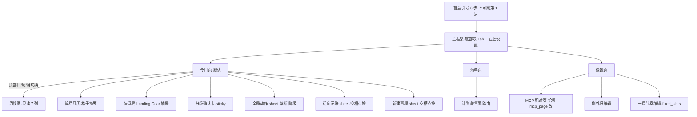
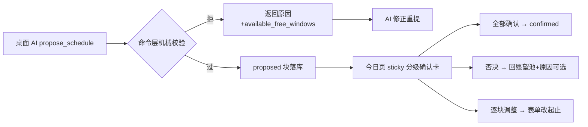

# 拾光 UI 设计规格（ui-spec）

> 上游：[schedule-app.md](schedule-app.md) §10（UI 结构/四形态/三手势/护航呈现）+ [functional-spec.md](functional-spec.md) §2（页面功能清单）。本文只做**布局化、组件化、状态化**——把已拍板机制翻译成可实装的界面规格，**不引入任何新机制**；发现缺口回上游补拍板。全文遵守中性语言禁令（§7）：界面只陈述事实，不审判。

## 0. 视觉基调与 Design Tokens

Material 3 为底（Flutter，拾贝同款），**关闭动态取色**、用固定品牌色板——拾光的视觉资产（香槟金/淡绿补给带/灰投影）是心理层的一部分，不能交给系统壁纸随机化。

### 0.1 色彩 tokens（2026-10-05 拍板：Material 3+固定品牌色板，关闭动态取色）

| Token | 值 | 用途 |
|---|---|---|
| `deepFocus` | 底 #283593 / 文字 #FFFFFF | 深度攻坚态块（高对比主战役） |
| `sparkCapsule` | 描边 #FFB300 / 底 #FFF8E1 | 微型火种态胶囊 |
| `roamSurface` | 底 #E3F2FD·12% / 边框 #90CAF9·40% | 漫游主题态（弱底弱框） |
| `celebration` | 底 #FFF3D6 / 描边 #D4AF37 | 庆祝勋章态（香槟金微光） |
| `supplyBand` | 底 #E8F5E9 / 虚线描边 #81C784 | 🛡️ 能量补给带（派生，不入库） |
| `freeFlow` | 底 #F1F8E9 | 🍃 自由流动区（派生） |
| `humanBlock` | #78909C·40% 实底 | human/手工块（现实色，与 AI 彩色区分） |
| `fixedSlotBg` | #ECEFF1 | fixed_slots 背景带 |
| `projection` | #F5F5F5 + 外链图标 | 系统日历投影块 |
| `missedAccent` | 原形态色降饱和 40% + 左标 #FFF3E0(4dp) | missed 中性标（2026-10-05 拍板方案 A） |
| `archivedFade` | 15% 透明度 | archived（断流保护/庆祝过期淡出） |
| `safelineOff/On` | outline #BDBDBD / 填充 #D4AF37 | 安全线徽章 |
| `textPrimary/Secondary` | #1A1C1E / #606468 | 正文/次要（中性灰，不用纯黑） |

### 0.2 其他 tokens

- **字体**：系统默认（思源黑体/Roboto），M3 尺度档；块内 label 用 body·medium，启动第一步（抽屉顶部）用 title·large——启动信息是全 app 最大的字。
- **圆角**：块 12dp / 卡片 16dp / 胶囊 999。
- **动效（全 app 仅三处）**：长按坍缩 300ms ease-out（块高收缩至 5min 等比，剩余释放为补给带）；右滑融化 400ms（不透明度+上移消散，**绝不显红**）；安全线点亮 250ms spring 单次。其余零动画（克制）。手势期间用 transform 不重排，守 60fps。
- **文案 tone**：陈述句、无主语审判（「未打卡」而非「未完成/失败/落后」）。

### 0.3 尺度与主题模式（Flutter 工程审查拍板 2026-10-05）

- **时间轴基准比例尺：1dp = 1min（60dp/h）**——常规作息聚焦窗（约 16.5h）总高 ≈990dp，单手 1–2 屏通览全天，认知负荷最低。
- **最小触控热区钳制：块渲染高度 clamp(min: 44dp)**（Material 最小触控目标）——物理时长 <44min 的块强制撑高至 44dp、内部单行居中排版；微型火种胶囊（5min）是该钳制的主要受益者。借用顺序：先借后置自由流动区/普通空白 → 仍不足则**向下溢出覆盖**（钳制块 z 序最高 + 4dp 投影），被覆盖的补给带/块按真实 y 位渲染、可见部分走 §6.5 过滤——**呼吸律补给带不被钳制清零**。
- **主题模式：MVP 强制锁定 Light Mode**，不适配 Dark Mode——香槟金/莫兰迪淡绿/淡灰投影的情绪安抚依赖精确对比度，暗色转换极微妙，MVP 仓促适配必破坏心理层设计；与固定色板（§0.1）共同构成首版降工期决策。

### 0.4 文案层：内黑话外白话（2026-10-05 拍板）

> **原则**：底层代码、数据字段、playbook 与本文档内部章节保留概念词（火种/spark/melted/熔断/换乘/Dangling/exceptions…），**用户可见界面文案零黑话**——平实、自解释、零认知负荷。三准则：**①动词优先于名词**（不说「形态」，直接说「只做 5 分钟」）；**②永远交代去向**（不说「消散/蒸发」，说「已放回清单待安排」）；**③系统是盟友不是法师**（越是大白话，减震与去负罪感越真实）。本表是用户可见字符串的**唯一事实源**，新增文案先入表再上屏。

**状态与形态**（科幻物理 → 生活直觉）：

| 内部术语（不上屏） | 界面文案 | 说明 |
|---|---|---|
| 黄金火种 `is_day_spark` | **今日核心** | 保留 🔥 图标；「今日核心 1 项」直指本质 |
| 微型火种态/坍缩 `spark` | **5 分钟启动版** | 提示「已切换为 5 分钟启动版」而非「已坍缩为火种」 |
| 漫游主题态 | 不出现形态名，直接呈现活动：「下午漫步：大理古城放空」 | 渲染弱底色+`~`，文案写活动本身 |
| 庆祝勋章态 | **犒劳时刻** | 「犒劳一下」贴近真实心理，无战争压迫感 |
| 能量补给带 `supplyBand` | **留白缓冲** | 传达「这是属于你的安全休息时间」 |
| 自由流动区 `freeFlow` | **自由支配时间**；仪表盘聚合标签「自由留白」 | 大白话：「这段时间完全由你支配」 |
| 安全线徽章 | **今日底线守住啦**；点亮提示「核心任务已搞定，今天底线已守住，剩余时间完全归你」 | |

**手势与操作**（玄学 → 明确预期）：

| 内部手势 | 界面文案 | 消除的担忧 |
|---|---|---|
| 右滑融化 `Melt` | **暂缓并收回清单**；完成提示「已暂缓，放回清单待安排」 | 最大暗坑：杜绝「是不是彻底删了再也找不到」的误删焦虑 |
| 长按坍缩 `spark` | **只做 5 分钟**；触发提示「已切换为 5 分钟启动版」 | 用户立刻理解「被缩减到极低阻力状态」 |
| 左滑换乘 `Swap` | **换件轻松的？**（抽屉标题） | 疲惫时的真实心态是「换件不费脑子的事」，不是坐地铁 |
| 沉浸中别理我 | **心流专注中 (+30m)** | 带共情温度，且说明会顺延后续安排 |
| 现实熔断键 | sheet 标题「**遇到突发情况？**」（§3.6） | 「熔断」是金融词，徒增紧张 |

**抽屉与长任务**（系统架构 → 具象行动）：

| 内部术语 | 界面文案 | 说明 |
|---|---|---|
| Landing Gear 启动第一步 | **马上开始**（+第一步内容） | 用户只需一眼看到「手头第一件事干嘛」，不需要知道起落架 |
| 悬空项目警报 `Dangling` | **「XX」已停滞 N 天，准备好挑酒店了吗？**（问句式） | 严禁出现「悬空/断流」字眼 |
| Clean Slate 断流保护 | **轻装重启**；「生活有时需要喘息，过去的事已安全归档，今天从一件小事开始」 | 无「断流/保护期」工业感词汇 |
| 例外日 `exceptions` | **假期与出行** | 用户理解的是「我在休假/出差」，不是程序异常 |
| 冷藏池 | **收起的旧想法 · N 条** | 不出现「冷藏」字眼 |

**M1 落地文案**（框架/引导/操作/设置，2026-10-05 随 M1 UI 段入表）：

| 位置 | 界面文案 | 说明 |
|---|---|---|
| 底部导航 | **日程** ｜ **清单** | 双 Tab 名；默认日程 |
| 快记入口 | FAB tooltip「记一笔」（草稿在盘亮 6dp 琥珀点，无文字）；抽屉 hint「记一笔，30 秒的事」；星=标重要；截止日 chip「截止」；保存钮「收入清单」 | 零细节捕获；永不关门（守卫态 FAB 恒在）；2026-10-06 自顶部快记条迁改 |
| 引导① | 「几点起床？几点睡觉？」+ 注「一切安排以此为界」 | 必填不可跳，未填不能进主框架 |
| 引导② | 「一周里哪些时间是有固定安排的？」；预设**上班族 / 学生 / 自由职业**；自由职业注「没有固定安排是完全正常的」 | 可跳过 |
| 引导③ | 「最小块粒度」「单日新增排量上限」+ 注「上限是休息权的模型支撑，不是效率指标」 | 可跳过；完成钮「开始使用」 |
| proposed 块 | 角标「提案」；三键「确认 / 否决 / 改时间」 | 确认=认可这一定位 |
| confirmed AI 块 | 按钮「心流专注中 (+30m)」 | 已在上方手势表 |
| done 块 | 右下 ✓；操作「打卡」 | 完成是正常事 |
| 空槽点按 | sheet「新建事项」/「从清单选」 | 逆向记账 M4 再入表 |
| 编辑表单 | 字段「做什么（label）」「从几点到几点」「保存」「删除」 | 点块表单（M1 形态） |
| 清单长按 | 「归档」「删除」「取消」 | 删除须二次确认 |
| 清单空态 | 「池子空空的——想到什么就记下来，30 秒的事」 | 已在空态表 |
| 设置页 | 「作息边界」「一周节奏」「MCP 服务」「运行中 / 已停止」「连接地址」「访问令牌」「重新生成」；注「桌面 AI 用此地址配对」 | 一周节奏 M1 只读展示（编辑器 M2） |
| 服务端供应 | 今天/明天日期、时刻 HH:MM | 界面不出现分钟数原值 |
| 日/周/月 | 顶部三段「日｜周｜月」；周头/月头「‹ ›」翻页；月格点阵无文字；例外日小标签 | 2026-10-06 随三段拍板入表 |

## 1. 信息架构与导航

- 双 Tab：**日程**（默认）｜**清单**。快记入口两 Tab 常驻=右下角 FAB+键盘吸附展开抽屉（2026-10-06 拍板，§3 层叠 Z 序见下）。设置右上角进。
- 周视图 = 日程 Tab 内顶部「日｜周」segment 切换（2026-10-05 拍板：只读 7 列、点块跳日）。

## 2. 首启引导（3 步）

| 步 | 内容 | 组件 | 文案要点 |
|---|---|---|---|
| ① 作息边界（**必填不可跳**） | 起床/睡觉两个 time picker | 大号时间选择卡 | 「一切安排以此为界」；未完成无法进入主框架（propose 硬拒的 UI 前置） |
| ② 一周节奏（可跳） | 模板三选：上班族/学生/**自由职业** | 模板卡 + 周模板编辑器（工作日/周末两套，按时段增删） | 自由职业=留空直接过：「没有固定安排是完全正常的」 |
| ③ 排程偏好（可跳） | 最小块粒度（15/30/60 segmented）、单日新增排量上限（slider） | 表单 | 「上限是休息权的模型支撑，不是效率指标」 |

完成即写 settings+fixed_slots；底部主按钮态（禁用/可用）随第①步填写联动。

## 3. 今日页（执行主场）——纵向结构

单页滚动（CustomScrollView），自上而下：

1. **双轨仪表盘条**：`🔥 今日核心 1 项 ｜ 🛡️ 自由留白 4.5h ｜ 🏅 今日底线守住啦`——徽章未点亮灰 outline、点亮金色填充+单次微动效，点亮提示「核心任务已搞定，今天底线已守住，剩余时间完全归你」；旁列电量三档 segmented（⚡/🔋/🪫，日切重置为 🔋 平稳；切 🪫 即触发机械降档，含晚点选的水流重算）。
2. **昨日遗留区**（有 missed 才渲染，空态消失）：逐条卡片三键——补勾（自动带「补记」标）/顺延今日/退回愿望池。Clean Slate 保护期整区转 archived 淡出视图。
3. **快记入口**：右下角 FAB（tooltip「记一笔」，草稿在盘亮琥珀点）→ 键盘吸附抽屉（输入框+一颗星+可选截止日 chip+「收入清单」）；永不关门（放工守卫例外条款=守卫态 FAB 恒在）；草稿三字段静默 KV、中途收起零询问（2026-10-06 自顶部常驻迁改）。
4. **分级确认卡**（有 proposed 提案时 sticky 于时间轴上方——2026-10-05 拍板：页内卡片而非独立页，确认成本最低）：火种卡突出（火种形态渲染+决策理由+缓冲保护说明），「其余 N 项日常推进」折叠区，三键=确认全部/否决（原因可选输入，AI 下轮参考）/逐块调整（进入逐块表单）。
   - **两态收缩（小屏视口防遮挡）**：展开态（默认）展示「今日核心」卡完整详情（为什么排在这+缓冲保护说明）+操作；用户下滑浏览时间轴时平滑坍缩为 **44dp 吸顶胶囊** `[⚡ AI 排程建议：重点攻坚 1 项，顺带推进 3 项 · 点击查看理由]`——随时可审且不遮视线；胶囊态保留「一键确认」快速通道，否决/逐块需点开展开。
5. **时间轴**（主体）：竖轴聚焦窗 = wake−1h ~ sleep；跨午夜块头部渲染为顶部「昨夜」灰带（BlockRenderer 负责）；当前时刻线=主题色 1dp 细线（不用红）；空槽点按 → 新建事项 sheet（「新建事项/从清单选」提名）或逆向记账 sheet（过去时段 → 「刚才做了什么」）。
6. **全局动作**：时间轴 header 右侧图标钮 → sheet 标题「**遇到突发情况？**」，三选项：`☕ 今天下午全清空（剩余计划退回清单）` / `⏳ 整体往后推 2 小时` / `🪫 今天精力见底，全部切换为 5 分钟启动版`；底部附注「**你的固定日程和自己排的事项不会被改动**」；两段式第二段确认，human 块永不动、无负罪感标记。**熔断优先于微调**（五轮），故一级直达。
7. **放工守卫态**（sleep−2h 触发）：隐藏遗留区/清单入口/推进提示，转静默视图（今日完成面+明日概要）；快记永不关门（FAB 恒在）。

**层叠 Z 序（2026-10-06 拍板）**：页面内容（时间轴/周/月网格/清单列表，Z=0）→ 快记 FAB（Z=20）→ 全局动作/块浮层 sheet（Z=30）→ 快记抽屉（Z=40，键盘吸附）。分级确认卡为 Column **内联件**（非浮层），不参与 z 竞争；FAB 与滚动内容底部重叠区以**滚动净空**化解（`tokens.fabClearanceDp=88dp`，末尾内容可滚出 FAB 覆盖区）；模态 sheet 与快记抽屉走独立路由天然在上。§6.5 的 44dp 钳制块「轴内 z 最高」为时间轴局部规则，与此并存。

## 4. 周视图与简易月历（M4·只读，2026-10-06 拍板：日/周/月三段并存）

### 4.1 周视图（只读 7 列网格，2026-10-05 原拍板恢复）

- 列=周一..周日（含选中日所在周，‹周››翻周）；列时间窗同日视图聚焦窗；块=BlockRenderer 简化渲染（紧凑卡：状态/来源着色、label 单行截断，无手势无浮层），点块跳日视图并定位该块。
- fixed_slots 浅灰背景带；今日列头高亮；零编辑能力（拖拽 V1.5 不变）。

### 4.2 简易月历（只读月网格）

- 月头「‹ 2026年10月 ›」翻月；格子**摘要渲染**（月格空间约束，全量渲染只在日/周承载）：日期号 + 状态点阵（每块一点：done=主色实心 / missed=中性灰 / proposed=主色空心 / human=灰；超出 4 点收敛「+N」）+ 🔥（当日火种达成）/ 🎂（有庆祝块）微标 + 例外日小标签（假期与出行）。
- **今日高亮圈**；点格跳日视图——日视图日期参数化，可回看历史（过去的日程串起来，账本视图）。

### 4.3 同源纪律

三视图与三日水位线同源：同一 SQLite 派生投影（blocksInRange 单查询分组），零第二真相；全部只读（编辑走日视图表单/手势）。

## 5. 清单页（灵魂的家）

- 快记 FAB 常驻（同今日页，右下角）。
- **三分区单页滚动**（同一数据的分组视图，非 tab）：
  1. **今天**——今日有块的 plan；
  2. **当下推进中**——有未来排期块的 plan；
  3. **待安排**——按四象限分组（Q1 重要×紧急 / Q2 重要 / Q3 紧急 / Q4 愿望池），**空组隐藏**；Q4 组名「愿望池」；**收纳区折叠置底**（标签「收起的旧想法 · N 条」，展开后才见条目——冷藏机制的视觉对应，界面不出现「冷藏」字眼）。
- **条目卡片**：title + 象限色点 + 「待确认 N 项」角标 + 🔥/🎂 标记 + deadline chip（临近转琥珀）；确定型计划显示 roadmap 进度「N/M 步」。
- 长按条目：归档/删除/挂起 bottom sheet。
- **详情页**（全页路由，内容多不用浮层）：spec（含 `## 路线图` 渲染：Checklist，`(ACTIVE)` 步 ▶ 高亮、`[x]` 划线）/ notes（**首行启动第一步**高亮框）/ open_items（可内联作答）/ reward_spec / 子树（≤3 级缩进）/ 「排期」快捷动作主按钮。

## 6. BlockRenderer 渲染矩阵（核心组件）

四维度叠加：**形态（4，定基础视觉）× 状态（7，定叠加层）× 来源（角标）× 手势（映射既有命令，零新语义）**。

### 6.1 形态 → 基础视觉（拍板自十四轮）

| 形态 | 触发 | 视觉 |
|---|---|---|
| 深度攻坚态 | energy=deep 且电量 high/normal | deepFocus 实底、白字、尾部 `[+15m 呼吸留白]` 锁扣 |
| 微型火种态 | spark（降级/低电量） | 窄胶囊（物理 5min，渲染经 §0.3 钳制 min 44dp）、sparkCapsule 描边、文字切 min_viable_action、无倒计时无进度条 |
| 漫游主题态 | 例外日 或 时长 ≥180min 开放任务 | roamSurface 弱底弱框、起止 `~` 显示（**仅渲染层，数据精确起止**） |
| 庆祝勋章态 | is_celebration | celebration 香槟金微光；过期→archived 淡出，**绝不显红** |

### 6.2 状态 → 叠加层

| 状态 | 叠加 |
|---|---|
| proposed | 虚线边框 + 「提案」角标 |
| confirmed | 实线（默认，无叠加） |
| done | 右下 ✓ 徽章，原色不灰化（完成是正常事，不庆祝不淡化） |
| skipped | ✓ 位换 ⊘，降饱和 |
| missed | 原形态色降饱和 40% + 左侧米黄 4dp 标 + 尾注「未打卡」（2026-10-05 拍板方案 A；绝不红，与 melted/archived 拉开三档层次） |
| archived | 15% 透明度、禁用交互（Clean Slate/庆祝过期） |
| melted | **不渲染**（无痕蒸发，仅当日水流摘要提及） |

### 6.3 来源角标：📋 来自清单 ｜ 📌 pinned ｜ 投影=灰底+外部图标且禁用全部手势（点击仅查看）。

### 6.4 手势 → 命令映射（全部已拍板，零新语义）

| 手势 | 命令 | 用户可见文案（§0.4） | 备注 |
|---|---|---|---|
| 轻点 | 打开块浮层（§7） | — | |
| 长按 | DegradeBlock(spark) | 「只做 5 分钟」入口；触发提示「已切换为 5 分钟启动版」 | 阻尼动画；human 块不可坍缩 |
| 左滑 | SwapBlock | 抽屉标题「换件轻松的？」 | 候选=待安排池 ±30min 的 light/anywhere 琐事；原任务无痕回池 |
| 右滑 | MeltBlock | 动作标签「**暂缓并收回清单**」；完成提示「已暂缓，放回清单待安排」 | **必须交代去向**，杜绝误删焦虑；绑 plan 时附「已花 X 分钟未入账，补记吗」（旅行推演拍板） |
| proposed 块内 | 确认/否决/改时间 三键 | — | |
| confirmed AI 块内 | +30min 级联顺延 | 按钮「心流专注中 (+30m)」 | human 块仅提示不级联 |

### 6.5 布局与手势的物理约束（Flutter 工程审查拍板 2026-10-05）

- **手工块重叠分栏**：重叠只可能发生在 human 侧（AI 块被校验整单拒绝、投影属 human 硬墙）——同一时段重叠的块自动切 **50% 等宽双列**，重叠块边缘亮橙色 1dp 细线提示碰撞但**完全放行**（§3 校验不对称「橙色提示」的渲染对应）。
- **手势防误触锁**：块上横滑触发须同时满足 **水平初位移 >20dp** 且 **|Δx/Δy| > 2.0**，不满足无条件交还外层垂直滚动；长按持续 **400ms** 触发（触发后播 §0.2 的 300ms 坍缩动画），按住期间卡片呼吸压缩（scale 0.98）给出意图感知。
- **滑动卡点与触觉反馈**：右滑融化过块宽 **45%** 吸附 + `HapticFeedback.mediumImpact`，松手执行消散，未过线弹回原位；左滑换乘过 **35%** 呼出换乘抽屉、原块弹回。
- **派生保护区三级绘制过滤**（防视觉噪点）：空隙 ≥30min 完整渲染（底色+虚线框+图标+文案）；15–30min 仅底色+居中图标（15dp 高度排不下可读文字，语义由图标承载、聚合数由双轨仪表盘表达，信息不丢）；**<15min 静默留白**（不渲染任何边框与装饰色）。

## 7. 块浮层（Landing Gear 抽屉）

bottom sheet（85% 高，可拖拽关闭），自上而下：**「马上开始」第一步**（title·large，全 app 最大字——用户不需要知道 Landing Gear 是什么，只需要一眼看到手头第一件事干嘛）→ 确定型长任务附 Roadmap（当前步 ▶+N/M 进度，探索型该区替换为 notes 进展摘要）→ spec/notes 关键上下文 → plan 链接（跳详情）→ 行动按钮区（依状态给：确认三键 / 打卡 done / +30min「心流专注中」/ 只做 5 分钟 / 换件轻松的 / 暂缓收回）。

## 8. 关键交互流

其余流按既有拍板直译：熔断两段式（一级选范围→二级确认→原子执行+中性摘要+可撤销）；逆向记账（空槽点按→挂已有 plan 或孤立 label→confirmed+done 落库，**事实通道豁免校验**，UI 全程无「补排程」暗示）；日切 digest（晨间首开：遗留区+AI 排程入口同屏）。

## 9. 空态与边界态

| 态 | 呈现 |
|---|---|
| 愿望池空 | 「池子空空的——想到什么就记下来，30 秒的事」+快记条聚焦 |
| 今日无块 | 「留白的一天，自由流动区已备好。想让 AI 排一排？打开桌面 AI 说『帮我排今天』」+手动创建入口 |
| MCP 未连接 | 设置页状态灯+今日页 AI 卡「桌面 AI 未连接——mDNS 搜索中…/手动填 IP」（网络配对拍板） |
| Clean Slate 期（界面文案「轻装重启」） | 遗留区 archived 淡出+「生活有时需要喘息，过去的事已安全归档，今天从一件小事开始」 |
| 放工守卫 | 静默视图（§3.7） |

## 10. 组件清单 × 里程碑裁剪

| 组件 | M1 | M2 | M3 | M4 |
|---|---|---|---|---|
| 引导 3 步/快记条/三分区清单/日视图基础块/确认三键/+30min/点块表单 | ✓ | | | |
| 遗留区/七状态全渲染/和平条款拒单反馈 | | ✓ | | |
| 双轨仪表盘/安全线/补给带流动区渲染/分级确认折叠/庆祝勋章/Clean Slate 视图 | | | ✓ | |
| 周视图/四形态全量/三手势/Landing Gear 抽屉 roadmap/天气图标/投影块 | | | | ✓ |

## 11. 拍板记录（2026-10-05）

1. **missed 中性视觉 = 方案 A**：原形态色降饱和 40% + 米黄左标 +「未打卡」文案——与 melted（不渲染）、archived（15% 淡出）拉开三档层次，绝不红。
2. **分级确认形态 = 页内 sticky 卡片**：确认成本最低、不打断当前视线；否决原因可选输入回传 AI。
3. **视觉基调 = Material 3 + 固定品牌色板（§0.1）**：关闭动态取色，心理层视觉资产（香槟金/补给带淡绿/灰投影）不被系统壁纸随机化；全自定义主题婉拒（MVP 成本不值）。
4bis. **日/周/月三段并存（2026-10-06 用户拍板，修订同日早前「月历替换」）**：日=参数化回看历史；周=7 列网格原拍板恢复；月=格子摘要月历。三视图同源派生、全部只读——见 schedule-app §11 台账行。
4. **微观标尺五项（Flutter 工程审查采纳，2026-10-05）**：时间轴比例尺 1dp/min + 44dp 触控钳制（§0.3）、确认卡两态收缩（§3.4）、手势锁与滑动卡点（§6.5）、保护区三级绘制过滤（§6.5）、human 重叠双列分栏橙线放行（§6.5）；并锁定 Light Mode（§0.3）。
5. **文案层「内黑话外白话」（2026-10-05 拍板）**：概念词保留在代码/playbook/设计文档，用户可见文案零黑话；词汇映射表（§0.4）=用户可见字符串唯一事实源——火种→今日核心、坍缩→5 分钟启动版、融化→暂缓并收回清单、熔断→遇到突发情况、换乘→换件轻松的、Landing Gear→马上开始、悬空→已停滞 N 天、Clean Slate→轻装重启、例外日→假期与出行、冷藏→收起的旧想法；新增文案先入表再上屏。
