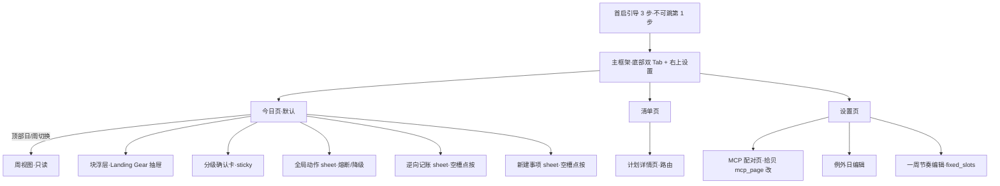
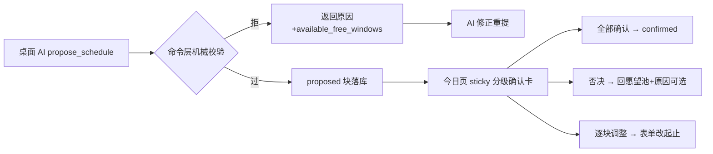

# 拾光 UI 设计规格（ui-spec）

> 上游：[schedule-app.md](schedule-app.md) §10（UI 结构/四形态/三手势/护航呈现）+ [functional-spec.md](functional-spec.md) §2（页面功能清单）。本文只做**布局化、组件化、状态化**——把已拍板机制翻译成可实装的界面规格，**不引入任何新机制**；发现缺口回上游补拍板。全文遵守中性语言禁令（§7）：界面只陈述事实，不审判。

## 0. 视觉基调与 Design Tokens

Material 3 为底（Flutter，拾贝同款），**关闭动态取色**、用固定品牌色板——拾光的视觉资产（香槟金/淡绿补给带/灰投影）是心理层的一部分，不能交给系统壁纸随机化。

### 0.1 色彩 tokens（2026-10-05 拍板：Material 3+固定品牌色板，关闭动态取色）

| Token | 值 | 用途 |
|---|---|---|
| `deepFocus` | 底 #283593 / 文字 #FFFFFF | 深度攻坚态块（高对比主战役） |
| `sparkCapsule` | 描边 #FFB300 / 底 #FFF8E1 | 微型火种态胶囊 |
| `roamSurface` | 底 #E3F2FD·12% / 边框 #90CAF9·40% | 漫游主题态（弱底弱框） |
| `celebration` | 底 #FFF3D6 / 描边 #D4AF37 | 庆祝勋章态（香槟金微光） |
| `supplyBand` | 底 #E8F5E9 / 虚线描边 #81C784 | 🛡️ 能量补给带（派生，不入库） |
| `freeFlow` | 底 #F1F8E9 | 🍃 自由流动区（派生） |
| `humanBlock` | #78909C·40% 实底 | human/手工块（现实色，与 AI 彩色区分） |
| `fixedSlotBg` | #ECEFF1 | fixed_slots 背景带 |
| `projection` | #F5F5F5 + 外链图标 | 系统日历投影块 |
| `missedAccent` | 原形态色降饱和 40% + 左标 #FFF3E0(4dp) | missed 中性标（2026-10-05 拍板方案 A） |
| `archivedFade` | 15% 透明度 | archived（断流保护/庆祝过期淡出） |
| `safelineOff/On` | outline #BDBDBD / 填充 #D4AF37 | 安全线徽章 |
| `textPrimary/Secondary` | #1A1C1E / #606468 | 正文/次要（中性灰，不用纯黑） |

### 0.2 其他 tokens

- **字体**：系统默认（思源黑体/Roboto），M3 尺度档；块内 label 用 body·medium，启动第一步（抽屉顶部）用 title·large——启动信息是全 app 最大的字。
- **圆角**：块 12dp / 卡片 16dp / 胶囊 999。
- **动效（全 app 仅三处）**：长按坍缩 300ms ease-out（块高收缩至 5min 等比，剩余释放为补给带）；右滑融化 400ms（不透明度+上移消散，**绝不显红**）；安全线点亮 250ms spring 单次。其余零动画（克制）。手势期间用 transform 不重排，守 60fps。
- **文案 tone**：陈述句、无主语审判（「未打卡」而非「未完成/失败/落后」）。

## 1. 信息架构与导航

- 双 Tab：**日程**（默认）｜**清单**。快记条两 Tab 顶部常驻。设置右上角进。
- 周视图 = 日程 Tab 内顶部「日｜周」segment 切换（2026-10-05 拍板：只读 7 列、点块跳日）。

## 2. 首启引导（3 步）

| 步 | 内容 | 组件 | 文案要点 |
|---|---|---|---|
| ① 作息边界（**必填不可跳**） | 起床/睡觉两个 time picker | 大号时间选择卡 | 「一切安排以此为界」；未完成无法进入主框架（propose 硬拒的 UI 前置） |
| ② 一周节奏（可跳） | 模板三选：上班族/学生/**自由职业** | 模板卡 + 周模板编辑器（工作日/周末两套，按时段增删） | 自由职业=留空直接过：「没有固定安排是完全正常的」 |
| ③ 排程偏好（可跳） | 最小块粒度（15/30/60 segmented）、单日新增排量上限（slider） | 表单 | 「上限是休息权的模型支撑，不是效率指标」 |

完成即写 settings+fixed_slots；底部主按钮态（禁用/可用）随第①步填写联动。

## 3. 今日页（执行主场）——纵向结构

单页滚动（CustomScrollView），自上而下：

1. **双轨仪表盘条**：`🔥 黄金火种 1 项 ｜ 🛡️ 自由保护 4.5h ｜ [安全线徽章]`——徽章未点亮灰 outline、点亮金色填充+单次微动效；旁列电量三档 segmented（⚡/🔋/🪫，日切重置为 🔋 平稳；切 🪫 即触发机械降档，含晚点选的水流重算）。
2. **昨日遗留区**（有 missed 才渲染，空态消失）：逐条卡片三键——补勾（自动带「补记」标）/顺延今日/退回愿望池。Clean Slate 保护期整区转 archived 淡出视图。
3. **快记条**：输入框+一颗星+可选截止日 chip；永不关门（放工守卫例外条款）。
4. **分级确认卡**（有 proposed 提案时 sticky 于时间轴上方——2026-10-05 拍板：页内卡片而非独立页，确认成本最低）：火种卡突出（火种形态渲染+决策理由+缓冲保护说明），「其余 N 项日常推进」折叠区，三键=确认全部/否决（原因可选输入，AI 下轮参考）/逐块调整（进入逐块表单）。
5. **时间轴**（主体）：竖轴聚焦窗 = wake−1h ~ sleep；跨午夜块头部渲染为顶部「昨夜」灰带（BlockRenderer 负责）；当前时刻线=主题色 1dp 细线（不用红）；空槽点按 → 新建事项 sheet（「新建事项/从清单选」提名）或逆向记账 sheet（过去时段 → 「刚才做了什么」）。
6. **全局动作**：时间轴 header 右侧图标钮 → 全局动作 sheet：现实熔断两段式（清空今日 AI 块/清空下午/暂缓 2h——第二段确认，human 块永不动、无负罪感标记）+「今天状态差，只做启动动作」（全局降级入口）。**熔断优先于微调**（五轮），故一级直达。
7. **放工守卫态**（sleep−2h 触发）：隐藏遗留区/清单入口/推进提示，转静默视图（今日完成面+明日概要）；快记条不关门。

## 4. 周视图（M4·只读）

7 列网格（周一起），列时间窗同日视图聚焦窗；块条=BlockRenderer 简化渲染（无手势无浮层，轻点跳日视图并定位该块）；列头=日期+**天气图标**（天气投影）；今日列高亮；fixed_slots 浅灰背景带、投影灰底。零编辑能力（拖拽 V1.5）。

## 5. 清单页（灵魂的家）

- 快记条常驻（同今日页）。
- **三分区单页滚动**（同一数据的分组视图，非 tab）：
  1. **今天**——今日有块的 plan；
  2. **当下推进中**——有未来排期块的 plan；
  3. **待安排**——按四象限分组（Q1 重要×紧急 / Q2 重要 / Q3 紧急 / Q4 愿望池），**空组隐藏**；Q4 组名「愿望池」；**冷藏池折叠区置底**（折叠态只显示「冷藏 N 条」，展开后才见条目——退出 digest 的视觉对应）。
- **条目卡片**：title + 象限色点 + 「待确认 N 项」角标 + 🔥/🎂 标记 + deadline chip（临近转琥珀）；确定型计划显示 roadmap 进度「N/M 步」。
- 长按条目：归档/删除/挂起 bottom sheet。
- **详情页**（全页路由，内容多不用浮层）：spec（含 `## 路线图` 渲染：Checklist，`(ACTIVE)` 步 ▶ 高亮、`[x]` 划线）/ notes（**首行启动第一步**高亮框）/ open_items（可内联作答）/ reward_spec / 子树（≤3 级缩进）/ 「排期」快捷动作主按钮。

## 6. BlockRenderer 渲染矩阵（核心组件）

四维度叠加：**形态（4，定基础视觉）× 状态（7，定叠加层）× 来源（角标）× 手势（映射既有命令，零新语义）**。

### 6.1 形态 → 基础视觉（拍板自十四轮）

| 形态 | 触发 | 视觉 |
|---|---|---|
| 深度攻坚态 | energy=deep 且电量 high/normal | deepFocus 实底、白字、尾部 `[+15m 呼吸留白]` 锁扣 |
| 微型火种态 | spark（降级/低电量） | 5min 等高胶囊、sparkCapsule 描边、文字切 min_viable_action、无倒计时无进度条 |
| 漫游主题态 | 例外日 或 时长 ≥180min 开放任务 | roamSurface 弱底弱框、起止 `~` 显示（**仅渲染层，数据精确起止**） |
| 庆祝勋章态 | is_celebration | celebration 香槟金微光；过期→archived 淡出，**绝不显红** |

### 6.2 状态 → 叠加层

| 状态 | 叠加 |
|---|---|
| proposed | 虚线边框 + 「提案」角标 |
| confirmed | 实线（默认，无叠加） |
| done | 右下 ✓ 徽章，原色不灰化（完成是正常事，不庆祝不淡化） |
| skipped | ✓ 位换 ⊘，降饱和 |
| missed | 原形态色降饱和 40% + 左侧米黄 4dp 标 + 尾注「未打卡」（2026-10-05 拍板方案 A；绝不红，与 melted/archived 拉开三档层次） |
| archived | 15% 透明度、禁用交互（Clean Slate/庆祝过期） |
| melted | **不渲染**（无痕蒸发，仅当日水流摘要提及） |

### 6.3 来源角标：📋 来自清单 ｜ 📌 pinned ｜ 投影=灰底+外部图标且禁用全部手势（点击仅查看）。

### 6.4 手势 → 命令映射（全部已拍板，零新语义）

| 手势 | 命令 | 备注 |
|---|---|---|
| 轻点 | 打开块浮层（§7） | |
| 长按 | DegradeBlock(spark) 原地坍缩 | 阻尼动画；human 块不可坍缩 |
| 左滑 | SwapBlock 换乘面板 | 候选=待安排池时长 ±30min 的 light/anywhere 琐事；原任务无痕回池 |
| 右滑 | MeltBlock 化为水汽 | 融化动画；块绑 plan 时提示「已花 X 分钟未入账，补记吗」（旅行推演拍板） |
| proposed 块内 | 确认/否决/改时间 三键 | |
| confirmed AI 块内 | +30min 级联顺延 · 沉浸中别理我（复用顺延） | human 块 +30min 仅提示不级联 |

## 7. 块浮层（Landing Gear 抽屉）

bottom sheet（85% 高，可拖拽关闭），自上而下：**启动第一步**（title·large，全 app 最大字）→ 确定型长任务附 Roadmap（当前步 ▶+N/M 进度，探索型该区替换为 notes 进展摘要）→ spec/notes 关键上下文 → plan 链接（跳详情）→ 行动按钮区（依状态给：确认三键 / 打卡 done / +30min / 沉浸中 / 降级 spark / 换乘 / 融化）。

## 8. 关键交互流

其余流按既有拍板直译：熔断两段式（一级选范围→二级确认→原子执行+中性摘要+可撤销）；逆向记账（空槽点按→挂已有 plan 或孤立 label→confirmed+done 落库，**事实通道豁免校验**，UI 全程无「补排程」暗示）；日切 digest（晨间首开：遗留区+AI 排程入口同屏）。

## 9. 空态与边界态

| 态 | 呈现 |
|---|---|
| 愿望池空 | 「池子空空的——想到什么就记下来，30 秒的事」+快记条聚焦 |
| 今日无块 | 「留白的一天，自由流动区已备好。想让 AI 排一排？打开桌面 AI 说『帮我排今天』」+手动创建入口 |
| MCP 未连接 | 设置页状态灯+今日页 AI 卡「桌面 AI 未连接——mDNS 搜索中…/手动填 IP」（网络配对拍板） |
| Clean Slate 期 | 遗留区 archived 淡出+一行「已静默保护，恢复交互即退出」 |
| 放工守卫 | 静默视图（§3.7） |

## 10. 组件清单 × 里程碑裁剪

| 组件 | M1 | M2 | M3 | M4 |
|---|---|---|---|---|
| 引导 3 步/快记条/三分区清单/日视图基础块/确认三键/+30min/点块表单 | ✓ | | | |
| 遗留区/七状态全渲染/和平条款拒单反馈 | | ✓ | | |
| 双轨仪表盘/安全线/补给带流动区渲染/分级确认折叠/庆祝勋章/Clean Slate 视图 | | | ✓ | |
| 周视图/四形态全量/三手势/Landing Gear 抽屉 roadmap/天气图标/投影块 | | | | ✓ |

## 11. 拍板记录（2026-10-05）

1. **missed 中性视觉 = 方案 A**：原形态色降饱和 40% + 米黄左标 +「未打卡」文案——与 melted（不渲染）、archived（15% 淡出）拉开三档层次，绝不红。
2. **分级确认形态 = 页内 sticky 卡片**：确认成本最低、不打断当前视线；否决原因可选输入回传 AI。
3. **视觉基调 = Material 3 + 固定品牌色板（§0.1）**：关闭动态取色，心理层视觉资产（香槟金/补给带淡绿/灰投影）不被系统壁纸随机化；全自定义主题婉拒（MVP 成本不值）。
